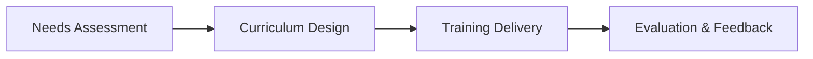

# Academy / Training Division Workflow

## Overview
This document describes the workflow for the Academy / Training Division role, including key stages, touchpoints, and best practices for effective training delivery.

## Workflow Diagram

## Typical Workflow Stages
1. **Needs Assessment:** Identify training gaps and objectives.
2. **Curriculum Design:** Develop training materials and structure.
3. **Training Delivery:** Conduct training sessions and workshops.
4. **Evaluation & Feedback:** Assess effectiveness and gather feedback.

## Key Responsibilities
- Assess training needs
- Design and deliver training
- Evaluate effectiveness
- Track learner progress
- Update curriculum as needed

## Example Transitions
- Needs Assessment → Curriculum Design
- Curriculum Design → Training Delivery
- Training Delivery → Evaluation & Feedback

## Touchpoints
- Training request forms
- Learning management system (LMS)
- Post-training surveys

## Best Practices
- Personalize training paths
- Use blended learning methods
- Measure training effectiveness
- Continuously update content
