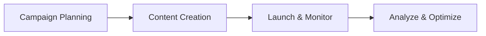

# Marketing & Growth Workflow

## Overview
This document describes the workflow for the Marketing & Growth role, including key stages, touchpoints, and best practices for campaign success.

## Workflow Diagram

## Typical Workflow Stages
1. **Campaign Planning:** Define goals, target audience, and strategy.
2. **Content Creation:** Develop creative assets and messaging.
3. **Launch & Monitor:** Execute campaigns and monitor performance.
4. **Analyze & Optimize:** Review results and refine future campaigns.

## Key Responsibilities
- Plan and execute campaigns
- Create marketing materials
- Analyze campaign performance
- Manage marketing channels
- Track ROI and KPIs

## Example Transitions
- Campaign Planning → Content Creation
- Content Creation → Launch & Monitor
- Launch & Monitor → Analyze & Optimize

## Touchpoints
- Campaign planning tools
- Social media/email platforms
- Analytics dashboards

## Best Practices
- Set clear KPIs
- Use A/B testing
- Leverage user feedback for optimization
- Document campaign learnings
