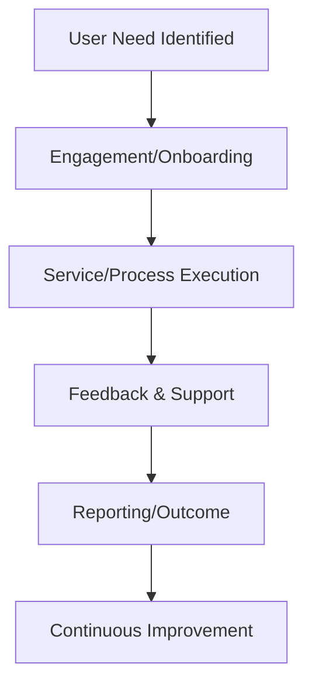

# Full User Journey Documentation

This document provides a comprehensive overview of user journeys across all major roles and workflows in the organization. Each journey is broken down into key stages, touchpoints, and outcomes, with actionable insights and best practices for optimizing the user experience.

---

## User Journey Map Overview

---

---

## 1. Business Operations

**User Journey:**
1. **Need Identification:** User or department submits a business need or request.
2. **Planning & Resource Allocation:** Operations team reviews, prioritizes, and allocates resources.
3. **Execution:** Processes are executed, monitored, and adjusted as needed.
4. **Reporting:** Outcomes and performance are reported to stakeholders.
5. **Feedback & Optimization:** Feedback is collected and used for process improvement.

**Touchpoints:**
- Request submission portal
- Status dashboards
- Automated notifications

**Best Practices:**
- Maintain clear communication channels
- Use data-driven decision making
- Regularly review and optimize processes

---

## 2. Customer Success

**User Journey:**
1. **Onboarding:** User is welcomed and guided through initial setup.
2. **Engagement:** Regular check-ins and proactive support.
3. **Support:** User requests help and receives timely assistance.
4. **Feedback:** User provides feedback on services.
5. **Renewal/Upsell:** Opportunities for renewal or additional services are presented.

**Touchpoints:**
- Onboarding sessions
- Support tickets/chat
- Customer satisfaction surveys

**Best Practices:**
- Personalize onboarding
- Track user health metrics
- Close the loop on feedback

---

## 3. Finance & Legal

**User Journey:**
1. **Request Submission:** User submits a financial or legal request.
2. **Processing:** Request is reviewed for accuracy and compliance.
3. **Approval:** Necessary approvals are obtained.
4. **Confirmation:** User receives status updates and final confirmation.
5. **Support:** Ongoing support for follow-up queries.

**Touchpoints:**
- Submission forms
- Approval workflows
- Automated status updates

**Best Practices:**
- Ensure transparency in processing
- Automate repetitive tasks
- Maintain compliance documentation

---

## 4. Marketing & Growth

**User Journey:**
1. **Campaign Ideation:** User/team identifies a marketing opportunity.
2. **Planning:** Campaign goals, audience, and channels are defined.
3. **Execution:** Content is created and campaigns are launched.
4. **Engagement:** Users interact with marketing materials.
5. **Analysis & Feedback:** Results are measured and inform future campaigns.

**Touchpoints:**
- Campaign planning tools
- Social media/email platforms
- Analytics dashboards

**Best Practices:**
- Set clear KPIs
- Use A/B testing
- Leverage user feedback for optimization

---

## 5. Sales & Partnerships

**User Journey:**
1. **Lead Generation:** User is identified as a potential client/partner.
2. **Qualification:** Sales team assesses fit and interest.
3. **Nurturing:** Relationship building and addressing objections.
4. **Proposal & Negotiation:** Terms are discussed and agreed upon.
5. **Onboarding:** User becomes a client/partner and is onboarded.

**Touchpoints:**
- CRM system
- Email/phone communication
- Onboarding materials

**Best Practices:**
- Qualify leads early
- Document all interactions
- Provide clear onboarding resources

---

## 6. Service Provider Onboarding & Quality Control

**User Journey:**
1. **Sourcing:** Service provider is identified or applies.
2. **Onboarding:** Provider completes onboarding requirements.
3. **Quality Assessment:** Initial and ongoing quality checks are performed.
4. **Monitoring:** Continuous monitoring and support.
5. **Compliance:** Regular compliance reviews and updates.

**Touchpoints:**
- Onboarding portal
- Quality assessment tools
- Compliance dashboards

**Best Practices:**
- Standardize onboarding steps
- Automate quality checks
- Provide ongoing training

---

## 7. Tech & Product

**User Journey:**
1. **Need Identification:** User or stakeholder reports a need/problem.
2. **Requirements Gathering:** Product/tech teams collect detailed requirements.
3. **Design & Prototyping:** Solution is designed, often with user input.
4. **Development:** Product is built and iterated.
5. **Testing:** Users participate in UAT and provide feedback.
6. **Deployment:** Product is released and users are onboarded.
7. **Support & Iteration:** Ongoing support and continuous improvement.

**Touchpoints:**
- Feature request forms
- User testing sessions
- Release notes and support channels

**Best Practices:**
- Involve users early and often
- Document requirements and changes
- Use analytics for improvement

---

## 8. Academy / Training Division

**User Journey:**
1. **Needs Assessment:** User/team identifies a training gap.
2. **Curriculum Design:** Training is designed to address needs.
3. **Delivery:** Training sessions are conducted.
4. **Evaluation:** User feedback and assessments are collected.
5. **Improvement:** Training is refined based on feedback.

**Touchpoints:**
- Training request forms
- Learning management system (LMS)
- Post-training surveys

**Best Practices:**
- Personalize training paths
- Use blended learning methods
- Measure training effectiveness

---

## Notes

---

## General Recommendations

- User journeys should be mapped and reviewed regularly.
- Collect both qualitative and quantitative feedback.
- Foster a culture of collaboration and transparency.
- Leverage automation to streamline repetitive steps.
- Ensure accessibility and inclusivity in all user touchpoints.
